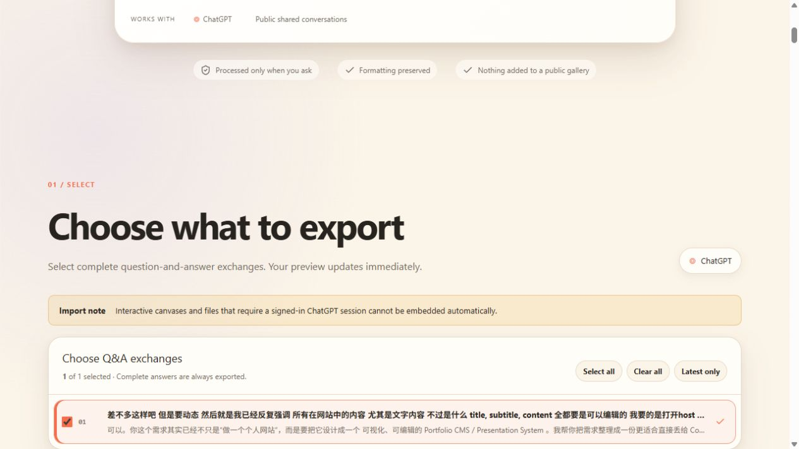
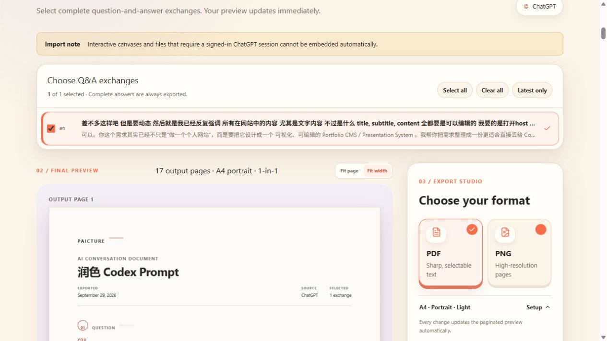
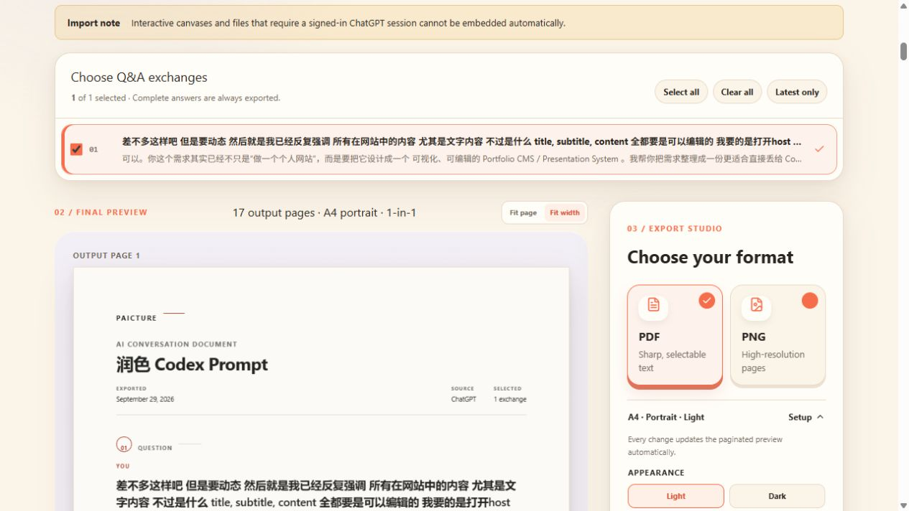
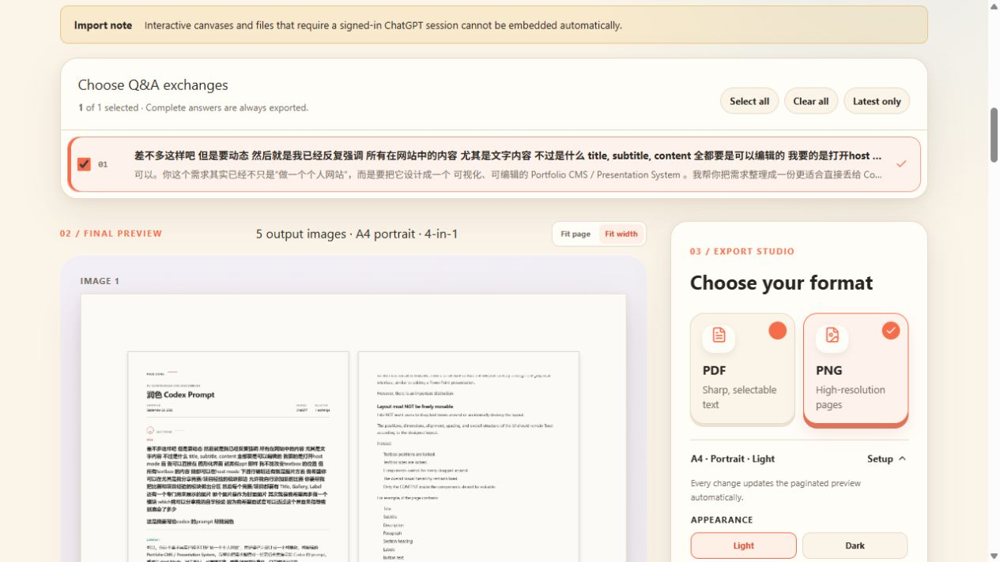
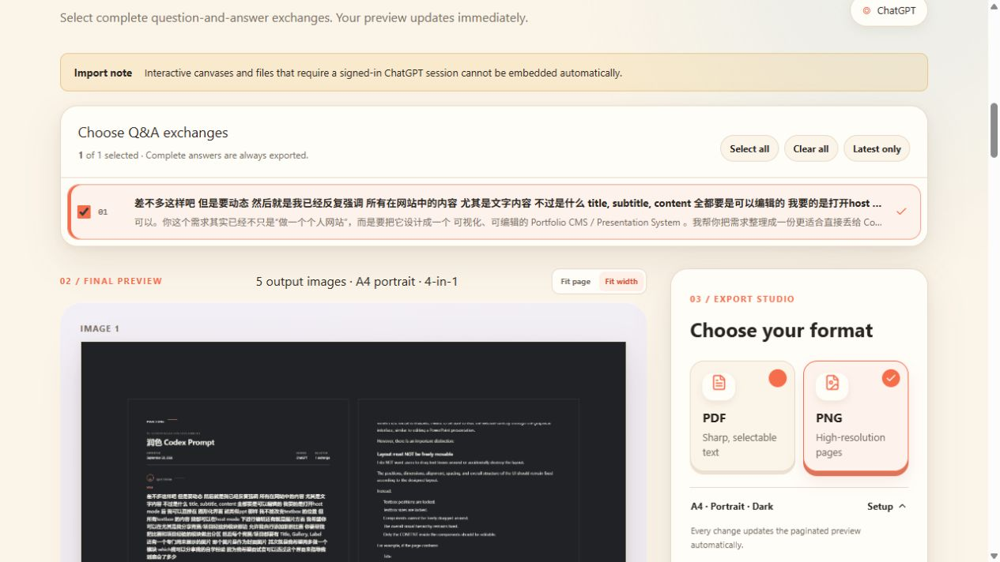
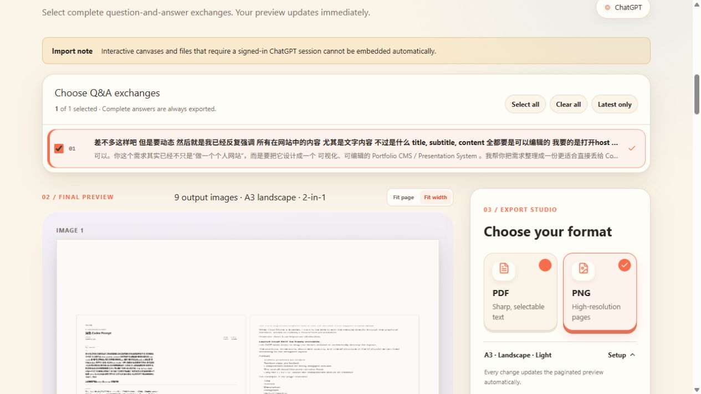

# pAIcture

pAIcture turns a public ChatGPT shared conversation into a selectable, paginated document and exports it as a vector PDF or high-resolution PNG pages.

[](https://paicture.vercel.app)
[](https://nextjs.org/)
[](LICENSE)

**[Open the live app →](https://paicture.vercel.app)**


## Highlights

- Imports real public ChatGPT share links without requesting account credentials or cookies.
- Groups the conversation into selectable Q&A exchanges and exports only what the user chooses.
- Preserves Markdown, code, tables, math, Unicode, links, and supported generated images.
- Provides a paginated WYSIWYG Export Studio with A4, A3, Letter, portrait, landscape, light/dark, and 1/2/4-up composition.
- Produces selectable-text Chromium PDFs and high-resolution PNG pages from the same canonical document renderer.
- Keeps each visitor's conversation in their current browser session; there is no public conversation-history database.

## Supported production workflow

`ChatGPT share URL → structured extraction → Q&A selection → WYSIWYG pages → PDF / PNG`

Public ChatGPT `/share/...` links are supported. pAIcture does not request ChatGPT credentials, cookies, private conversation URLs, browser extensions, or manual transcripts.

## Architecture

- **Application:** React 19 + Next.js-compatible routes, deployed on Vercel.
- **Retriever and PDF renderer:** Node.js 22 + Playwright Chromium, deployed as a private-token-protected Render web service.
- **Import:** the application validates the ChatGPT URL, the retriever downloads the public page, and the application decodes ChatGPT's structured hydration payload.
- **Images:** public generated-image assets are resolved during import and returned as stable data URLs for preview/export.
- **Privacy:** pasted links and imported conversations stay in the current browser tab only. Links are cleared after a successful import, API responses are marked `private, no-store`, and the service has no conversation-history database.
- **Concurrency:** the Chromium worker uses a bounded queue (`MAX_CONCURRENT_JOBS`, `MAX_QUEUED_JOBS`) so simultaneous visitors wait safely instead of exhausting the instance with unlimited browser processes.
- **PDF:** semantic HTML is rendered by Chromium to a tagged, selectable-text PDF.
- **PNG:** the same canonical document renderer is rasterized at high DPI in the browser and downloaded as page PNGs/ZIP.
- **Storage:** no database or persistent user-content storage is required. Conversation data is processed per request and in the browser.

The split deployment is intentional: edge/serverless routes provide the UI and API boundary, while Chromium runs in a conventional Node service that supports the browser binary and longer rendering work.

## Requirements

- Node.js `>=22.13.0`
- pnpm matching the lockfile
- Chromium installed through Playwright for the extractor

## Local development

```bash
pnpm install --frozen-lockfile
cp .env.example .env.local
pnpm exec playwright install chromium
pnpm extractor:start
pnpm dev
```

Use one long random value for `CHATGPT_EXTRACTOR_TOKEN` in both the application and extractor environments. The values in `.env.example` are local-only examples.

## Environment variables

| Variable | Service | Purpose |
| --- | --- | --- |
| `CHATGPT_EXTRACTOR_URL` | Application | HTTPS base URL of the Render extractor. |
| `CHATGPT_EXTRACTOR_TOKEN` | Both | Shared bearer secret. Required by the production extractor. Never expose it to client code. |
| `ALLOWED_ORIGINS` | Extractor | Comma-separated browser origins allowed to call the service. Server-to-server calls are authenticated by token. |
| `MAX_CONCURRENT_JOBS` | Extractor | Maximum active Chromium-backed jobs. Defaults to `1`, which is appropriate for the current low-memory Render instance. |
| `MAX_QUEUED_JOBS` | Extractor | Maximum waiting jobs before returning a retryable busy response. Defaults to `12`. |
| `NODE_ENV` | Extractor | Must be `production` in production; makes a missing token a startup error. |
| `PLAYWRIGHT_BROWSERS_PATH` | Extractor | Browser installation path configuration used by Render. |
| `PORT` | Extractor | Listening port supplied by the hosting provider. |

Do not commit `.env`, `.env.local`, tokens, account credentials, or session data.

## Build and verification

```bash
pnpm lint
pnpm test
pnpm build
```

The production application uses the native Next.js build defined in `vercel.json`. The existing Vinext/Cloudflare build remains available for local and legacy deployment verification.

## Product gallery

| Import and selection | WYSIWYG document preview |
| --- | --- |
|  |  |
| **PDF Export Studio** | **High-resolution PNG composition** |
|  |  |
| **Dark document appearance** | **A3 landscape composition** |
|  |  |

The complete set of 12 portfolio-ready images is stored in [`public/project-gallery`](public/project-gallery).

## Production deployment

### 1. Extractor on Render

`render.yaml` defines the Node service, Chromium installation, health check, and non-secret environment values.

1. Create/sync the Render Blueprint from this repository.
2. Set `CHATGPT_EXTRACTOR_TOKEN` as a Render secret.
3. Keep `ALLOWED_ORIGINS` restricted to the production pAIcture origin(s).
4. Confirm `GET /health` returns `{ "ok": true }`.

### 2. Application on Vercel

The public production application is deployed at:

- `https://paicture.vercel.app`

Set these Vercel Production environment variables:

- `CHATGPT_EXTRACTOR_URL=https://<render-service-host>`
- `CHATGPT_EXTRACTOR_TOKEN=<the same secret>`

Deploy with `vercel --prod` (or connect the existing GitHub repository for automatic deployments). `vercel.json` keeps the native Next.js build separate from the legacy Sites/Cloudflare build. After deployment, verify a real public ChatGPT share import and both PDF and PNG downloads; a homepage-only smoke test is insufficient.

## Redeployment checklist

1. Run lint, tests, and the production build.
2. Deploy the Render service and confirm `/health` plus one real import.
3. Deploy the Vercel application with matching environment variables.
4. Test Q&A selection, generated images, all page settings, PDF, PNG, and responsive layouts on the live URL.
5. Tag the exact verified commit.

## Rollback

Known checkpoints are Git tags. To inspect or restore one safely:

```bash
git show stable-pre-production
git switch --detach stable-pre-production
```

For a hosted rollback, redeploy the tagged commit to Render and Vercel with the existing production secrets. Do not overwrite a working branch with `git reset --hard`; create a rollback branch from the tag instead:

```bash
git switch -c codex/rollback-stable-pre-production stable-pre-production
```

## Security boundaries

- Only HTTPS `chatgpt.com/share/...` targets are accepted, including every followed redirect.
- Generated-image downloads are limited to trusted ChatGPT/OpenAI asset hosts.
- Chromium PDF rendering blocks outbound network requests; imported images are embedded before rendering.
- Imported HTML is allow-list sanitized and script/event-handler markup is removed.
- The production extractor fails to start without its bearer token.
- User-facing errors omit stack traces and upstream implementation details.

## License

Licensed under the [MIT License](LICENSE).
